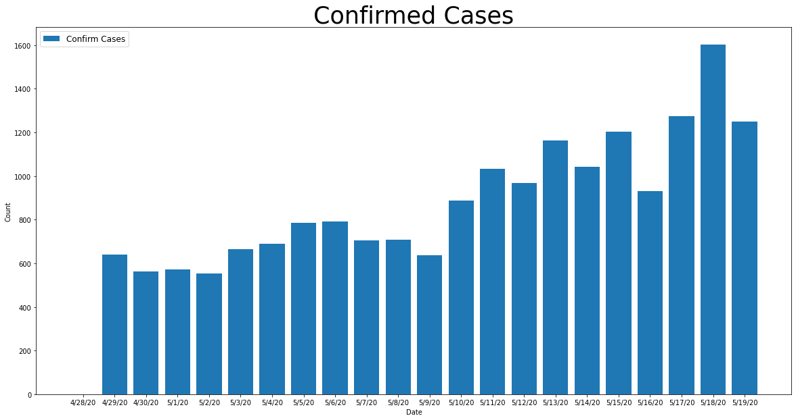

# Author: Kazi Amit Hasan

Department of Computer Science & Engineering,  
Rajshahi University of Engineering & Technology (RUET)  
Website: https://amithasanshuvo.github.io/  
Linkedin: https://www.linkedin.com/in/kazi-amit-hasan-514443140/  
Email: kaziamithasan89@gmail.com  

## Dataset Description:
The dataset in given in this repository, but to work with the latest dataset please download dataset from the following links.  
1. https://www.kaggle.com/sudalairajkumar/novel-corona-virus-2019-dataset
2. https://www.kaggle.com/imdevskp/corona-virus-report

After downloading the datasets, unzip them and you can see two csv files named "covid_19_clean_complete.csv" and "covid_19_data.csv". These two datasets are used in this project.

## Project Description

This is originally a kaggle competition. I tried to visualize and analyze the confirmed, death and recovery rates of various countries.
Then I tried to analyze the impacts of COVID-19 on Bangladesh by analyzing the confirmed, death and recovery graph plots and tried to predict the future rates by using Fbprophet algorithm.  
You may also find my notebook in kaggle.  
Link: https://www.kaggle.com/amithasanshuvo/covid-19-analysis-on-bangladesh/ (Please upvote if you like it and leave a comment to suggest me some more improvements.)
## Data Visualizations
Confirmed Cases:

Recovery Cases:

Death Cases:

## Results
1. The percentage of Predicted recovery after confirmation is 17.53%.
2. The percentage of Predicted Death after confirmation is 1.32%.

## Conclusion:
If you like this repository and please put a star. This will keep me motivated to work more on these. You may also check my kernel in kaggle. Upvote if you like it.  
Kaggle kernel link: https://www.kaggle.com/amithasanshuvo/covid-19-analysis-on-bangladesh/ 
